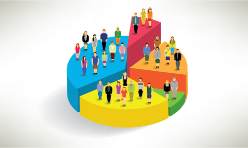

## Customer Segmentation Overview

Customer segmentation is the practice of dividing a company's customers into groups that reflect similarity among customers in each group.

   

## Customer-Segmentation

Perform cluster analysis and dimensionality reduction to segment customers.
I have used both hierarchical and flat clustering techniques, ultimately focusing on the K-means algorithm. Along the way, I have also visualized the data appropriately to understand the methods. Ultimately, I employed Principal Components Analysis (PCA) through the scikit-learn package. Finally, combined the two (PCA+Kmeans) models to obtain a better segmentation. 

## Segment Interpretation
Once segmented, customers’ behavior will require some interpretation. And I have used the descriptive statistics by brand and by segment and visualized the findings. Through the descriptive analysis, I formed hypotheses about the segments, thus ultimately setting the ground for the subsequent modeling.

## Elastic Modeling
In this step, I have done elastic modeling by calculating purchase probability elasticity, brand choice own price elasticity, brand choice cross-price elasticity, and purchase quantity elasticity. We will employ linear regressions and logistic regressions. 

## Predict Future Behavior
Finally, I leveraged the power of Deep Learning to predict future behavior using Feed Forward Neural Network.

