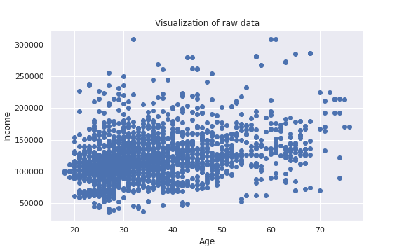
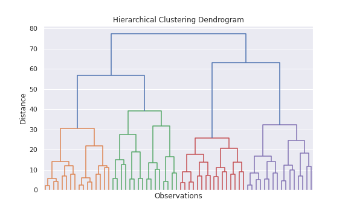
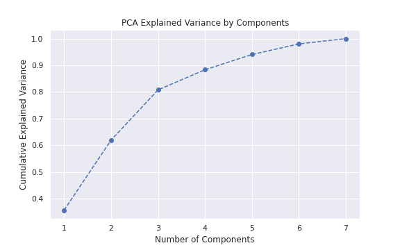
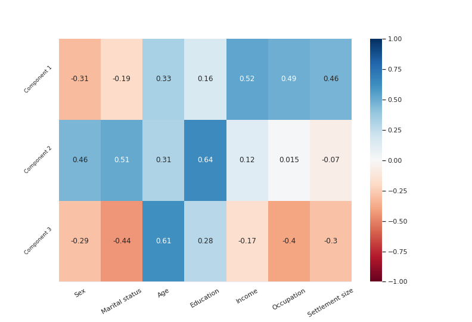
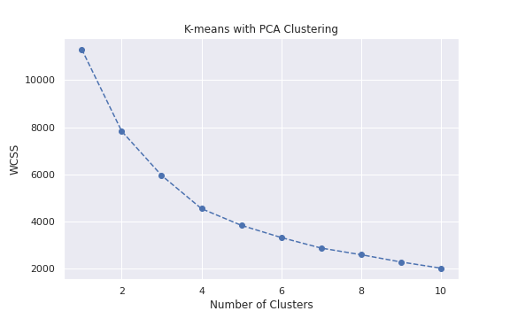
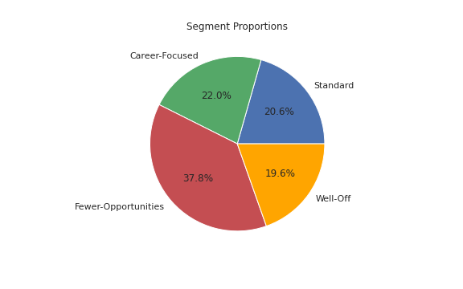
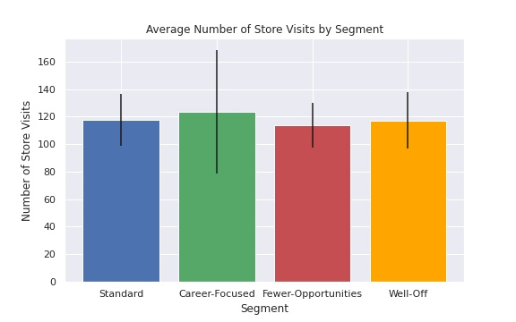
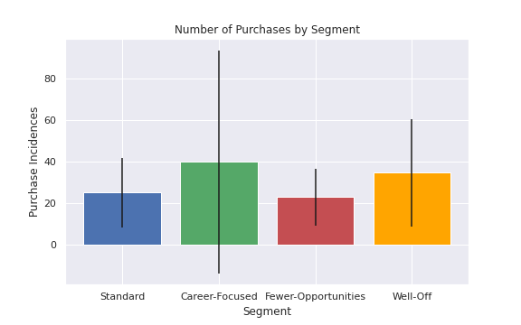
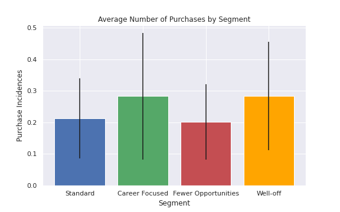
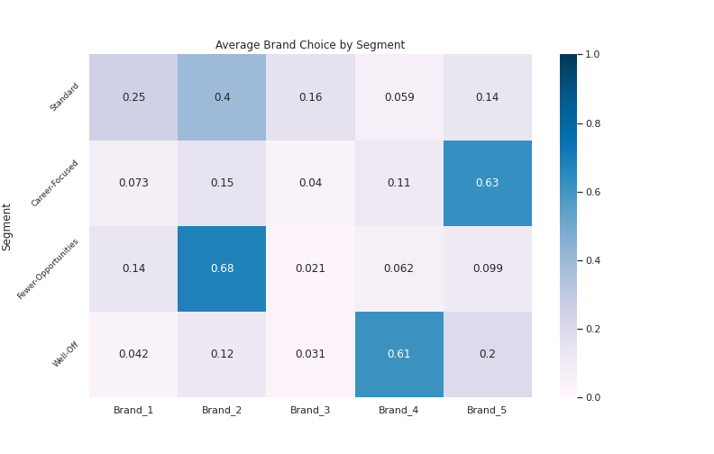

## Customer-Segmentation

Perform cluster analysis and dimensionality reduction to segment customers.
We will show both hierarchical and flat clustering techniques, ultimately focusing on the K-means algorithm. Along the way, we will visualize the data appropriately to understand the methods even further. We will then employ Principal Components Analysis (PCA) through the scikit-learn package. Finally, we’ll combine the two models to reach an even better insight about customers. 

## Segment Interpretation
Once segmented, customers’ behavior will require some interpretation. And we will use the descriptive statistics by brand and by segment and visualizing the findings. Through the descriptive analysis, we will form hypotheses about the segments, thus ultimately setting the ground for the subsequent modeling.

## Elastic Modeling
In this next step We will do elastic modeling by calculating purchase probability elasticity, brand choice own price elasticity, brand choice cross-price elasticity, and purchase quantity elasticity. We will employ linear regressions and logistic regressions. 

## Predict Future Behavior
Finally, we’ll leverage the power of Deep Learning to predict future behavior using Feed Forward Neural Network.

