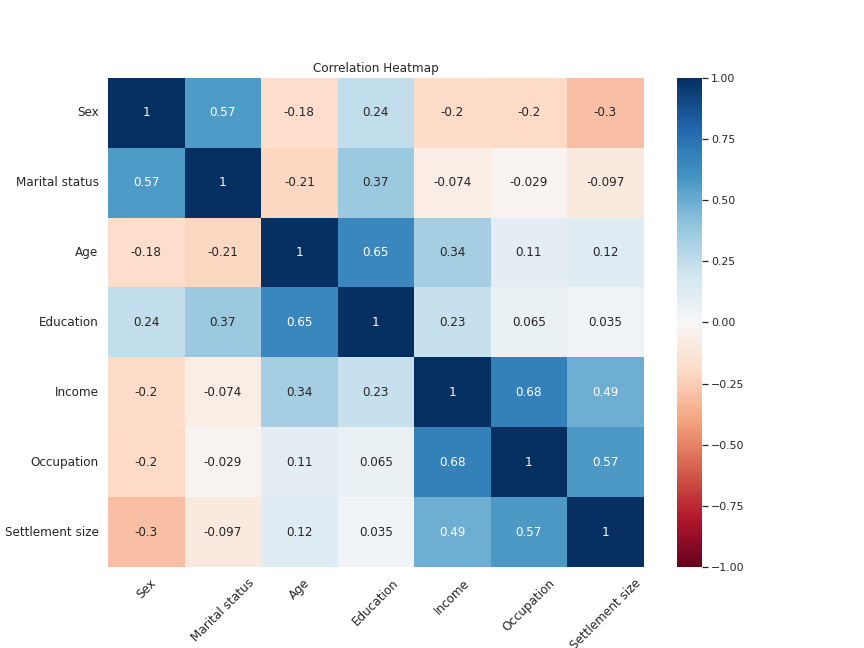
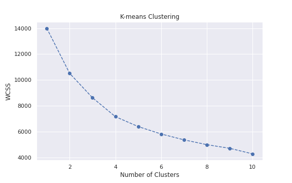

## Customer-Segmentation

#CORRELATION ESTIMATION

#VISUALIZATION OF RAW DATA

#HIERARCHICAL CLUSTERING

#KMEANS CLUSTERING

#RESULT ANALYSIS

#PCA

#PCA COMPONENTS

#K-MEANS WITH PCA

#K-MEANS WITH PCA RESULTS

#DESCRIPTIVE ANLAYSIS

#Purchase OCCASSION AND INDICES

#BRAND CHOICE

